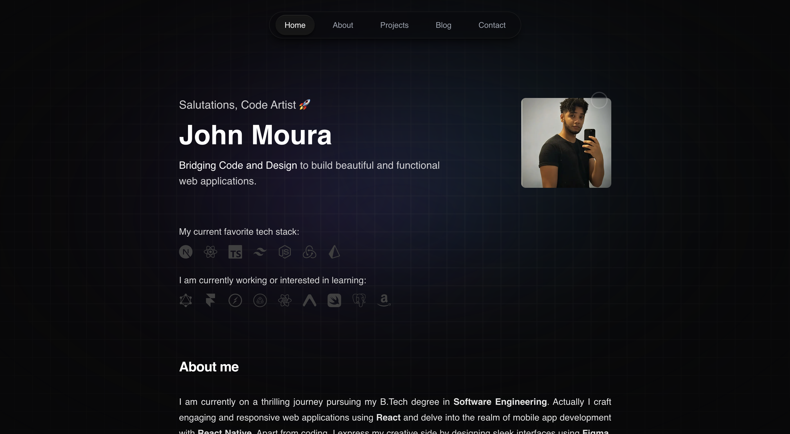

# John Moura - Full Stack Developer 👨‍💻

Welcome to my Portfolio website! Here you'll find a collection of projects showcasing my skills as a Full Stack Developer.

## Tech Stack:
✅ **Frontend**
  - Next.js
  - Tailwind CSS
  - React Query
  - Shadcn UI
  - Framer Motion
  - Mantine

✅  **Backend**
  - Hygraph (CMS)
  - GraphQL
  - Node.js
  - Axios

✅ **Tools and Other Technologies**
  - Figma
  - Git and GitHub
 

## Let's Connect:

- [LinkedIn](https://www.linkedin.com/in/jovimoura10/) - Connect with me on LinkedIn for professional networking.
- [Portfolio Website](https://jovimoura.vercel.app/) - Explore my portfolio website to learn more about my work.

Feel free to explore the repositories and don't hesitate to reach out for collaboration or any questions!
